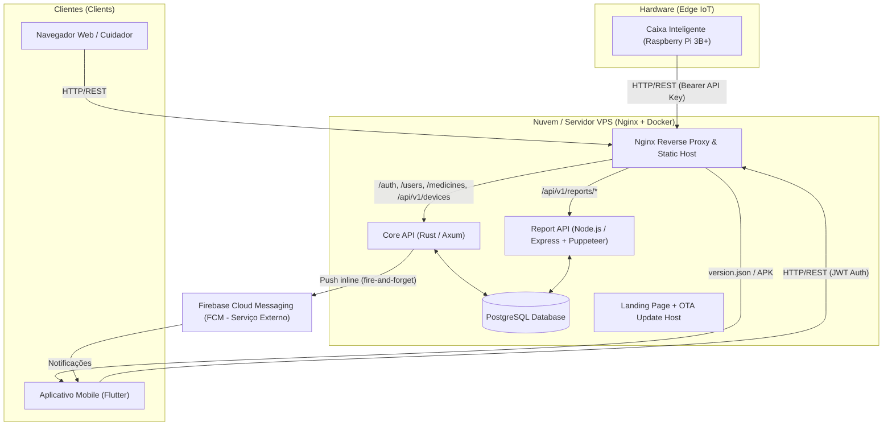
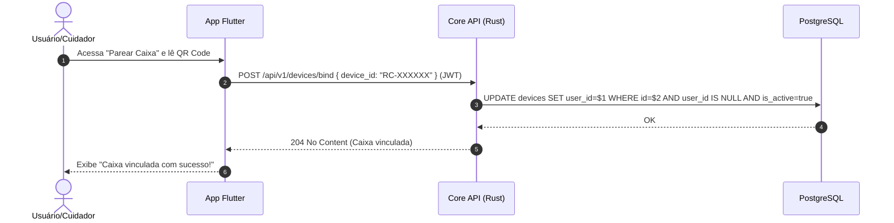
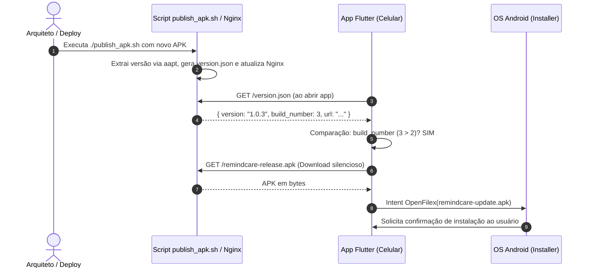

# RemindCare Ecosystem - Technical Architecture & End-to-End Specification

> **Document Type:** System Specification & Agent Context Reference  
> **Target Audience:** AI Coding Agents, System Architects, Developers  
> **Version:** 2.1.0  
> **Last Updated:** 2026-07-25  

---

## 1. Propósito e Visão Geral do Sistema (Purpose & System Overview)

**RemindCare** é um ecossistema completo de telemedicina e assistência à saúde voltado para o monitoramento remoto da adesão medicamentosa de pacientes idosos e crônicos. 

### O Problema Solucionado
A não-adesão ao tratamento medicamentoso é uma das maiores causas de complicações médicas e internações evitáveis em idosos. O esquecimento, a confusão de horários e a falta de visibilidade para cuidadores e médicos reduzem a eficácia dos tratamentos.

### A Solução RemindCare
O ecossistema une **Hardware IoT (Caixa Inteligente)**, **Servidor Backend de Alta Performance** e **Aplicativo Mobile**, permitindo que:
1. O paciente seja lembrado visualmente e sonoramente pela caixa e pelo aplicativo no momento exato de tomar o remédio.
2. A abertura dos compartimentos seja registrada instantaneamente via telemetria IoT.
3. Cuidadores e médicos acompanhem em tempo real a adesão (no prazo, atrasado, esquecido ou antecipado).
4. Relatórios médicos em PDF sejam gerados automaticamente com métricas clínicas detalhadas.

---

## 2. Arquitetura Geral do Ecossistema (System Architecture)



---

## 3. Componentes do Ecossistema

### 3.1. Caixa Inteligente (Hardware Edge - Raspberry Pi 3B+)
- **Processador / Computador de Borda:** Raspberry Pi 3B+ (SBC - Single Board Computer) rodando sistema operacional Linux (Debian/Raspbian).
- **Sensores & Atuadores:** Sensores de presença/abertura nos compartimentos de medicamentos conectados aos pinos GPIO, LEDs indicadores por compartimento e bipe sonoro (Buzzer).
- **Autenticação:** Header `Authorization: Bearer <api_key>` para autenticação do dispositivo junto à API (a chave é provisionada pelo servidor e armazenada apenas como hash SHA-256 no banco).
- **Ciclo de Vida & Telemetria:**
  - **Heartbeat:** Dispara requisições `POST /api/v1/devices/heartbeat` periodicamente (a cada ~15 a 35 minutos) para sinalizar estado `online`. O servidor atualiza `last_heartbeat_at`; o status `offline` é inferido pelo tempo decorrido desde o último heartbeat.
  - **Eventos de Dosagem:** Quando o compartimento é aberto, a aplicação na Raspberry Pi envia `POST /api/v1/devices/events` com o `event_type`, o `timestamp` (Unix) e um objeto `metadata` (JSON) — que, para eventos clínicos (`event_type: "medication_status"`), inclui o `medication_id` e a `situation` já classificada na borda.

---

### 3.2. Servidor Backend (`remindcare_backend`)

O backend é organizado como um **Monorepo** rodando via Docker Compose na VPS (Ubuntu):

#### A. `core_api` (Serviço Principal - Rust / Axum)
- **Crate/Binário:** `rust_raw_server` (o diretório se chama `core_api`, mas o crate/binário/container é `rust_raw_server`). Escuta na porta interna `7878`.
- **Linguagem/Framework:** Rust 1.93 (edition 2024), Axum 0.8, SQLx (PostgreSQL, com cache offline `.sqlx`), Tokio.
- **Identificadores:** IDs de usuários, medicamentos, logs e refresh tokens são **UUIDv4** (para evitar vulnerabilidades de IDOR). **Exceção:** o ID de dispositivo é uma string no formato `RC-XXXXXX`.
- **Responsabilidades:**
  - Autenticação e gestão de usuários (argon2id para senhas, JWT HS256 de 15 min + refresh tokens de 7 dias).
  - Gestão de medicamentos, horários e compartimentos.
  - Recebimento e persistência dos eventos da caixa IoT. **A classificação clínica (`onTime`/`late`/`missed`/`early`) é feita na borda (caixa) e enviada em `metadata.situation`; o servidor apenas a armazena (assumindo `missed` quando ausente), não a recalcula.**
  - Associação e pareamento de dispositivos IoT com contas de usuários (`POST /api/v1/devices/bind`).
  - Disparo de notificações Push via Firebase Cloud Messaging (FCM) de forma inline (fire-and-forget) durante o processamento dos eventos — não há um worker/serviço separado.

#### B. `report_api` (Serviço de Relatórios - Node.js / Puppeteer)
- **Linguagem/Stack:** Node.js 20, Express, Puppeteer (Headless Chrome).
- **Timezone:** Estritamente fixado em `America/Sao_Paulo` (UTC-3).
- **Responsabilidades:**
  - Consulta o PostgreSQL diretamente para compilar estatísticas de adesão (porcentagem de remédios tomados no prazo, atrasados, perdidos e antecipados).
  - Renderiza templates HTML e gera documentos PDF em alta resolução contendo gráficos e tabela clínica detalhada para médicos.

#### C. `landing_page_vue` / `landing_page` (Landing Page & Servidor de Arquivos OTA)
- **Stack:** Vue.js 3 + Vite, hospedado diretamente pelo Nginx.
- **Servidor OTA (Over-The-Air):** Hospeda o arquivo `version.json` e o `remindcare-release.apk` compilado para distribuir atualizações automáticas para os celulares Android.

#### D. Infraestrutura (Nginx + Postgres + Certbot)
- **Nginx:** Roteador principal de borda, gerencia SSL/TLS (HTTPS) e faz o balanceamento entre os containers.
- **PostgreSQL:** Banco de dados relacional com suporte a metadados SQLx offline para compilação estática do Rust.

---

### 3.3. Aplicativo Mobile (`telemed_app`)
- **Framework:** Flutter (Dart).
- **Compatibilidade:** Android & iOS.
- **Principais Funcionalidades:**
  - **Dashboard de Adesão:** Exibe os medicamentos do dia, barras de status da semana e status da caixinha (Online/Offline).
  - **Linha do Tempo (Timeline):** Registro detalhado do histórico de doses tomadas, com filtros por status (`onTime`, `late`, `missed`, `early`).
  - **Cadastro de Medicamentos com Autopreenchimento:** Consome a base nacional de medicamentos (`assets/bulario_brasil.json`) para autocomplete.
  - **Pareamento IoT:** Cadastro do UUID/MAC da caixinha para vínculo de conta.
  - **Atualizador In-App (OTA):** Serviço `UpdateService` que consulta `https://remindcare.com.br/version.json` no arranque do aplicativo. Se o `build_number` do servidor for maior, exibe caixa de diálogo e realiza o download e instalação do APK nativamente.

---

## 4. Classificação Clínica de Eventos (Event Status Logic)

Toda interação do paciente com os compartimentos é classificada segundo a janela temporal abaixo, em relação ao horário agendado ($H$). **Importante:** essa classificação é calculada na **borda (caixa IoT)** e enviada ao servidor no campo `metadata.situation`; o backend (`core_api`) apenas **persiste** o status recebido (assumindo `missed` quando ausente) e o utiliza para montar a notificação Push. As janelas abaixo são a definição clínica de referência do sistema:

| Status | Nome no Sistema | Descrição Clínica | Janela Temporal Padrão |
| :--- | :--- | :--- | :--- |
| **No Prazo** | `onTime` | Remédio tomado no horário correto. | Entre $(H - 15\text{min})$ e $(H + 15\text{min})$ |
| **Atrasado** | `late` | Remédio tomado após o horário, mas dentro de um limite aceitável. | Entre $(H + 15\text{min})$ e $(H + 120\text{min})$ |
| **Antecipado**| `early` | Remédio tomado antes da janela de tolerância. | Antes de $(H - 15\text{min})$ |
| **Perdido** | `missed` | Compartimento não foi aberto e o tempo de tolerância expirou. | Após $(H + 120\text{min})$ sem registro |

---

## 5. Fluxos de Ponta a Ponta (End-to-End Workflows)

### 5.1. Fluxo de Pareamento da Caixinha IoT
1. O usuário abre o aplicativo Flutter e acessa a função "Parear Caixa".
2. O app lê o UUID/MAC da caixa (via QR Code ou digitação).
3. O app envia `POST /api/v1/devices/bind` com o `device_id` (formato `RC-XXXXXX`) e o Token JWT do usuário para a `core_api`.
4. A `core_api` vincula o dispositivo no PostgreSQL apenas se ele existir, estiver ativo e ainda não estiver pareado (`devices.user_id = user.id`).
5. A caixa passa a pertencer àquele usuário.



---

### 5.2. Fluxo de Telemetria e Notificação em Tempo Real
1. O paciente abre o compartimento da caixinha IoT no horário do medicamento.
2. A caixa (Raspberry Pi 3B+) classifica a abertura na borda e envia `POST /api/v1/devices/events` com o header `Authorization: Bearer <api_key>` e um `metadata` contendo `event_type: "medication_status"`, `medication_id` e `situation`.
3. A `core_api` grava a telemetria em `device_events` e, para eventos `medication_status`, cria o registro clínico em `medicine_logs` com a `situation` recebida.
4. Se o usuário dono possuir `fcm_token`, a `core_api` dispara (inline, fire-and-forget) uma Push Notification via Firebase.
5. O aplicativo Flutter recebe a notificação e atualiza o Dashboard.

```mermaid
sequenceDiagram
    autonumber
    participant Box as Caixa IoT (Raspberry Pi 3B+)
    participant API as Core API (Rust)
    participant DB as PostgreSQL
    participant FCM as Firebase FCM
    participant App as App Flutter

    Box->>API: POST /api/v1/devices/events (Bearer API Key, metadata.situation)
    API->>DB: INSERT device_events + INSERT medicine_logs (situation recebida)
    API->>FCM: send_fcm_message (inline, fire-and-forget)
    FCM->>App: Push Notification ("Caixa Inteligente")
    App->>API: GET /medicines/logs (Atualiza Dashboard)
    API-->>App: Retorna histórico do dia
```

---

### 5.3. Fluxo de Atualização Automática (In-App OTA Update)
1. O Arquiteto executa `./publish_apk.sh` no repositório backend fornecendo o novo `.apk`.
2. O script extrai via `aapt` a versão real (`versionName`) e o build (`versionCode`), gerando o `version.json` e enviando o APK para o Nginx.
3. Quando o aplicativo Flutter é aberto pelo usuário, o `UpdateService` faz `GET https://remindcare.com.br/version.json`.
4. Se o `build_number` do servidor for maior que o do aplicativo instalado, o app exibe um `AlertDialog` com o progresso do download.
5. Ao concluir o download, o `OpenFilex` invoca a intent de instalação nativa do Android (`REQUEST_INSTALL_PACKAGES`), atualizando o app.



---

## 6. Estrutura de Arquivos e Repositórios

```text
remindcare_backend/ (Monorepo Backend)
├── core_api/                     # API principal em Rust (crate `rust_raw_server`, Axum + SQLx)
│   ├── src/
│   │   ├── routes/              # Endpoints HTTP (auth, users, medicine, device, admin, health)
│   │   ├── models/              # Estruturas de dados e DTOs
│   │   ├── services/            # Lógica de negócios
│   │   ├── repositories/        # Consultas puras SQL
│   │   └── auth/                # Extractors JWT (AuthUser) e API Key (AuthDevice)
│   ├── migrations/             # Migrations SQLx (schema PostgreSQL)
│   └── .sqlx/                  # Cache offline de queries (necessário para o build Docker)
├── report_api/                   # API de relatórios PDF em Node.js (Express + Puppeteer)
├── landing_page_vue/             # Código fonte (Vue 3 + Vite) da Landing Page e gerador do version.json
├── landing_page/                 # Arquivos estáticos servidos pelo Nginx (dist + APK + version.json)
├── nginx/                        # Configurações do Nginx (dev e prod)
├── publish_apk.sh                # Script de automação e validação de deploy de APKs (Arquiteto)
├── deploy.sh                     # Script de deploy na VPS
├── docker-compose.yml            # Orquestração para desenvolvimento local
└── docker-compose.prod.yml       # Orquestração de containers de produção (Nginx + Certbot + APIs)

telemed_app/ (Aplicativo Mobile Flutter)
├── android/                      # Configurações nativas Android (AndroidManifest com REQUEST_INSTALL_PACKAGES)
├── assets/
│   ├── bulario_brasil.json       # Base de dados estática para autocomplete de medicamentos
│   └── images/                   # Logotipos e identidades visuais
├── lib/
│   ├── models/                   # Modelos Dart (Medicine, MedicineLog, User, Device)
│   ├── pages/                    # Telas (home_page, timeline_page, profile_page, box_page, etc.)
│   ├── services/                 # Comunicação com APIs (update_service, medicine_service, etc.)
│   └── main.dart                 # Ponto de entrada do aplicativo
└── pubspec.yaml                  # Configuração de versão (ex: 1.0.3+3) e dependências
```

---

## 7. Diretrizes para Agentes e LLMs de Código

1. **Imutabilidade de IDs:** NUNCA altere tipos de ID para inteiros simples. Usuários, medicamentos, logs e refresh tokens usam **UUIDv4**; dispositivos usam o identificador string `RC-XXXXXX`.
2. **Timezone Estrito:** A aplicação opera no fuso horário de Brasília (`America/Sao_Paulo` / UTC-3). Datas e logs de medicação devem respeitar essa conversão.
3. **Versionamento do App:** Ao alterar código no Flutter que exija deploy, o campo `version` no `pubspec.yaml` DEVE seguir o formato `X.Y.Z+N` onde `N` é um número inteiro incremental (`build_number`).
4. **Deploy de APK:** Nunca edite o `version.json` à mão na VPS. Utilize sempre o script `./publish_apk.sh` no backend para garantir validação via `aapt`.
