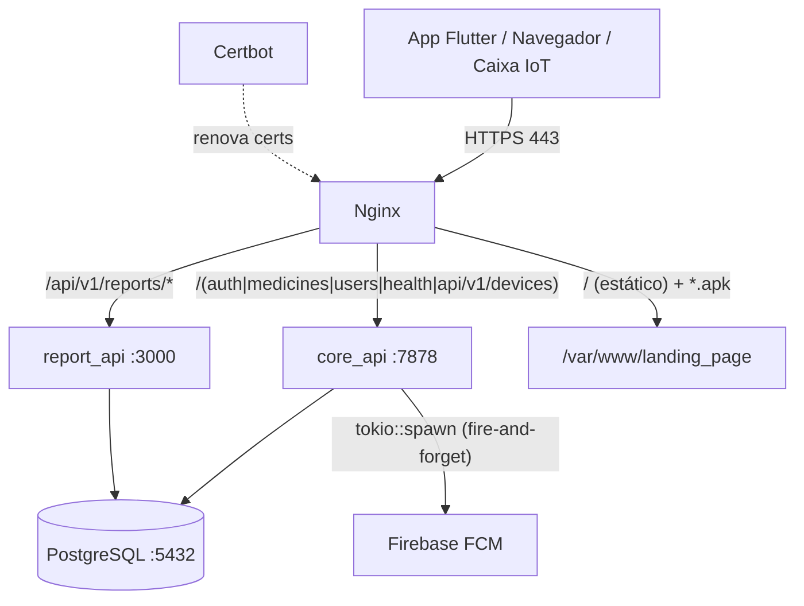
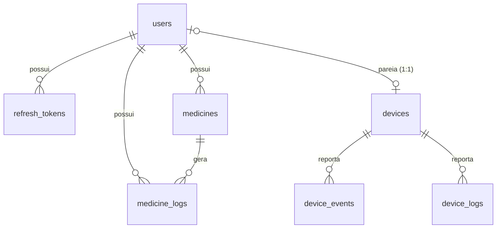

# RemindCare — Documentação Técnica do Servidor (Backend)

> **Tipo de documento:** Referência técnica de engenharia / Contexto para agentes de IA
> **Escopo:** SOMENTE o backend (`remindcare_backend`). Não cobre o app Flutter nem o firmware da caixa IoT, exceto onde eles interagem com a API.
> **Fonte da verdade:** Derivado diretamente do código-fonte deste repositório (não da visão de produto do `ARCHITECTURE.md`).
> **Referência de commit:** `15f01ad` (branch `main`).
> **Produção:** `https://remindcare.com.br` — VPS DigitalOcean (droplet) em `143.198.172.110`, path `/root/remind_care_core`.

> **AVISO PARA AGENTES:** O arquivo `ARCHITECTURE.md` descreve a **visão de produto** e em vários pontos diverge do que está implementado. **Este documento (`SERVER.md`) descreve o comportamento real do código.** Onde houver divergência com `ARCHITECTURE.md`, confie neste. As divergências conhecidas estão listadas na seção [12. Divergências e armadilhas conhecidas](#12-divergências-e-armadilhas-conhecidas).

---

## Índice

1. [Visão geral do servidor](#1-visão-geral-do-servidor)
2. [Topologia de produção (Docker/Nginx)](#2-topologia-de-produção-dockernginx)
3. [Roteamento do Nginx](#3-roteamento-do-nginx)
4. [core_api — serviço principal (Rust/Axum)](#4-core_api--serviço-principal-rustaxum)
5. [Autenticação e segurança](#5-autenticação-e-segurança)
6. [Referência completa da API — core_api](#6-referência-completa-da-api--core_api)
7. [report_api — serviço de relatórios (Node.js)](#7-report_api--serviço-de-relatórios-nodejs)
8. [Landing page e OTA (distribuição do APK)](#8-landing-page-e-ota-distribuição-do-apk)
9. [Modelo de dados (PostgreSQL)](#9-modelo-de-dados-postgresql)
10. [Notificações Push (FCM)](#10-notificações-push-fcm)
11. [Variáveis de ambiente](#11-variáveis-de-ambiente)
12. [Divergências e armadilhas conhecidas](#12-divergências-e-armadilhas-conhecidas)
13. [Fluxos de deploy e operação](#13-fluxos-de-deploy-e-operação)
14. [Convenções para agentes](#14-convenções-para-agentes)

---

## 1. Visão geral do servidor

O backend é um **monorepo** orquestrado por Docker Compose. Em produção há 4 serviços de aplicação + 1 de renovação de certificado:

| Serviço | Stack | Papel | Porta interna |
| :--- | :--- | :--- | :--- |
| `core_api` | Rust 1.93 · Axum 0.8 · SQLx · Tokio | API principal (auth, usuários, medicamentos, dispositivos IoT, push) | `7878` |
| `report_api` | Node.js 20 · Express 5 · Puppeteer | Geração de PDF de adesão + estatísticas | `3000` |
| `postgres` | PostgreSQL 16 | Banco relacional único (compartilhado pelas duas APIs) | `5432` |
| `nginx` | Nginx alpine | Reverse proxy de borda, TLS, host estático da landing page/APK | `80`, `443` |
| `certbot` | Certbot | Renovação automática de certificados Let's Encrypt | — |

**Pontos-chave que um agente precisa saber de imediato:**
- O crate Rust se chama **`rust_raw_server`** (não `core_api`). O binário e o container também.
- Só o Nginx é exposto ao mundo (80/443). As APIs só são acessíveis pela rede interna do Docker.
- Existe **um único PostgreSQL**; `report_api` faz `SELECT` direto nas tabelas criadas/migradas pela `core_api`.
- Toda a lógica de negócio de escrita passa pela `core_api`. O `report_api` é **somente leitura**.
- IDs de usuários/medicamentos/logs são **UUIDv4**. IDs de dispositivos são strings `RC-XXXXXX` (não UUID).

---

## 2. Topologia de produção (Docker/Nginx)

Arquivo de produção: `docker-compose.prod.yml`. Usa `env_file: .env.production` (esse arquivo existe apenas na VPS; **não está versionado**).



Detalhes dos containers (produção):

- **postgres** — imagem `postgres:16`, container `rust_server_postgres`, `restart: always`, volume nomeado `postgres_data`. Variáveis `POSTGRES_USER`, `POSTGRES_PASSWORD`, `POSTGRES_DB` via `.env.production`. Em produção **não** publica a porta 5432 no host.
- **api** — build de `./core_api`, container `rust_server_api`, `restart: always`, `depends_on: postgres`. Monta `./core_api/service_account.json:/app/service_account.json:ro` (credenciais Firebase) e `./firmware_releases:/app/firmware_releases:ro` (binários OTA). `expose: 7878`. Healthcheck: `curl -f http://localhost:7878/health` a cada 10s.
- **report_api** — build de `./report_api`, container `rust_server_report_api`, `expose: 3000`. Healthcheck: `wget --spider http://localhost:3000/health`.
- **nginx** — imagem `nginx:alpine`, container `rust_server_nginx`, `ports: 80:80, 443:443`. Monta `./nginx/nginx.prod.conf`, `./landing_page` (estático), `./certbot/conf` e `./certbot/www`. Faz `nginx -s reload` a cada 6h (para pegar renovação de cert).
- **certbot** — imagem `certbot/certbot`, roda `certbot renew` a cada 12h.

> Existe também `docker-compose.yml` (ambiente de desenvolvimento): apenas `postgres` + `api` + `nginx`, usa `.env.dev`, publica Postgres em `5432` e Nginx em `8081:80`, sem `report_api`/`certbot`. `nginx/nginx.conf` é a config de dev (HTTP puro).

---

## 3. Roteamento do Nginx

Arquivo: `nginx/nginx.prod.conf`. Dois `server` blocks para o host `remindcare.com.br`:

**Porta 80 (HTTP):** serve `/.well-known/acme-challenge/` (validação Certbot) e redireciona todo o resto para HTTPS (`301`).

**Porta 443 (HTTPS):** certificados em `/etc/letsencrypt/live/remindcare.com.br/`. Security headers aplicados: `Strict-Transport-Security` (HSTS 1 ano + subdomains), `X-Frame-Options: SAMEORIGIN`, `X-XSS-Protection`, `X-Content-Type-Options: nosniff`.

Ordem de roteamento (mapeamento path → upstream):

| Match Nginx | Destino | Observação |
| :--- | :--- | :--- |
| `location /` | `root /var/www/landing_page` | SPA Vue estática (`try_files $uri $uri/ =404`) |
| `location ~* \.apk$` | `root /var/www/landing_page` | Força `Content-Disposition: attachment` e `application/vnd.android.package-archive` |
| `location ~ ^/(auth\|medicines\|users\|health\|api/v1/devices\|api/v1/admin)` | `http://api:7878` | **core_api** — repassa `Host`, `X-Real-IP`, `X-Forwarded-*`; `proxy_buffering off` + `proxy_read_timeout 300s` (OTA de firmware) |
| `location /api/v1/reports/` | `http://report_api:3000/` | **report_api** — a barra final **remove o prefixo** `/api/v1/reports` |

> **Importante (mapeamento de path externo → interno):**
> - `POST https://remindcare.com.br/auth/login` → `core_api` `POST /auth/login`.
> - `GET https://remindcare.com.br/api/v1/reports/doc` → `report_api` `GET /doc` (o prefixo `/api/v1/reports` é retirado pela barra final no `proxy_pass`).
> - As rotas de usuários/medicamentos/auth **NÃO** têm prefixo `/api/v1`. Apenas dispositivos e admin usam `/api/v1/...`.

---

## 4. core_api — serviço principal (Rust/Axum)

- **Crate:** `rust_raw_server` v0.1.0, edition **2024**. Base Docker: `rust:1.93` (builder) → `rust:1.93-slim` (runtime).
- **Bind:** `0.0.0.0:7878` (`src/main.rs`).
- **Arquitetura em camadas:** `routes/` (handlers HTTP) → `services/` (lógica) → `repositories/` (SQL puro via SQLx) → `models/` (DTOs/entidades). Extractors de auth em `auth/`. Respostas de erro padronizadas em `responses/api_response.rs`.
- **SQLx offline:** queries verificadas em tempo de compilação via cache `.sqlx/` (`SQLX_OFFLINE=true` no build). Ao criar/alterar query, rode `cargo sqlx prepare` e commite o `.sqlx/`.

### 4.1. Estrutura de `core_api/src`

```
core_api/src/
├── main.rs                 # bootstrap: env, DB pool, migrations, FCM, bind :7878
├── lib.rs                  # exporta módulos (crate rust_raw_server)
├── app.rs                  # build_app(): AppState, CORS, rate-limit, router
├── config.rs               # Config::from_env()
├── telemetry.rs            # tracing (JSON em produção)
├── auth/
│   ├── jwt.rs              # argon2, create/decode JWT, refresh token (sha256)
│   ├── extractor.rs        # AuthUser (JWT Bearer)
│   └── device_extractor.rs # AuthDevice (API key Bearer → sha256 lookup)
├── models/                 # user, auth, medicine, device (structs + Validate)
├── repositories/           # users, refresh_tokens, medicine, device (SQL)
├── services/               # auth, users, medicine, device (regras)
├── routes/                 # health, auth, users, medicine, device, admin
└── responses/api_response.rs # helpers de erro (ApiError = (StatusCode, Json<Value>))
```

### 4.2. Bootstrap (`main.rs`)

1. `dotenv().ok()` carrega `.env` se existir.
2. `Config::from_env()` — falha imediata (`panic`) se faltar `DATABASE_URL`, `JWT_SECRET` ou `ADMIN_SECRET_KEY`.
3. `PgPool::connect` no PostgreSQL.
4. `sqlx::migrate!()` roda migrations embutidas no binário. **(No Docker, o `docker-entrypoint.sh` também roda `sqlx migrate run` antes de subir — logo, as migrations rodam duas vezes; é idempotente.)**
5. Abre `service_account.json`; se existir, ativa o gerenciador de token FCM (`fcm_manager: Some`), senão push fica desativado (`None`).

### 4.3. Middleware global (`app.rs`)

- **CORS:** origem permitida por predicado — exatamente `https://remindcare.com.br`, ou qualquer `http://localhost:*`, ou `http://127.0.0.1:*`. Métodos `GET, POST, PUT, DELETE`. Headers `Authorization`, `Content-Type`.
- **Rate limiting (`tower_governor`):** aplicado **apenas** ao grupo `/auth/*`. Config: `per_second(2)`, `burst_size(10)`. Task de limpeza a cada 300s. As demais rotas **não têm rate limit**.

### 4.4. Formato de erro padrão

Todos os erros retornam JSON no formato:

```json
{ "error": "mensagem" }
```

Helpers (`responses/api_response.rs`): `internal_error` (500), `not_found` (404), `unauthorized` (401), `conflict` (409), `validation_error` (400). Erros de validação de payload (crate `validator`) retornam `400` com `{"error":"Invalid ... payload"}`.

---

## 5. Autenticação e segurança

Há **três** mecanismos de autenticação distintos:

### 5.1. JWT de usuário (app mobile / web) — `AuthUser`

- Header: `Authorization: Bearer <access_token>`.
- Algoritmo: **HS256** (`jsonwebtoken`, `Header::default()`), segredo = `JWT_SECRET`.
- Claims: `{ "sub": "<uuid do usuário>", "exp": <unix ts> }`.
- **Access token expira em 15 minutos** (`Duration::minutes(15)`).
- Validação (`Validation::default()`) checa assinatura e `exp`.
- Extractor: `auth/extractor.rs` — extrai `user_id: Uuid` de `claims.sub`.

**Refresh tokens:**
- Gerados como **UUIDv4 em texto puro** (retornado ao cliente).
- Armazenados no banco como **hash SHA-256 hex** (`refresh_tokens.token_hash`).
- Expiram em **7 dias**.
- `POST /auth/refresh` valida o hash (não revogado / não expirado) e emite novo access token.
- `POST /auth/logout` marca `revoked_at`.

**Senhas:** hash **Argon2** (`Argon2::default()` = Argon2id), com salt aleatório. Hashing roda em `spawn_blocking`.

### 5.2. API key de dispositivo (caixa IoT) — `AuthDevice`

- Header: `Authorization: Bearer <api_key>` — **NÃO** é `X-API-Key` (o `ARCHITECTURE.md` diz `X-API-Key`, mas o código usa `Bearer`).
- A API key é gerada no provisionamento: **48 caracteres** alfanuméricos.
- No banco guarda-se apenas o **SHA-256 hex** em `devices.api_key_hash`.
- O extractor (`auth/device_extractor.rs`) calcula o SHA-256 da chave recebida e faz `SELECT ... FROM devices WHERE api_key_hash = $1`.
- Rejeita dispositivo **desconhecido** (`401 "Unknown device"`) ou **desativado** (`401 "Device is deactivated"`).
- `AuthDevice` carrega `device_id: String` e `user_id: Option<Uuid>` (o dono pareado, se houver).

### 5.3. Segredo de admin (provisionamento / OTA) — `X-Admin-Secret`

- Header: `X-Admin-Secret: <valor>`, comparado com `ADMIN_SECRET_KEY`.
- Usado em `POST /api/v1/admin/provision` e `POST /api/v1/admin/firmware`.

### 5.4. Notas de segurança relevantes

- `GET /users` exige JWT, mas **retorna todos os usuários do sistema** — não há checagem de papel/admin.
- `PublicUser` (respostas de usuário) **inclui o `fcm_token`** no JSON.
- Autorização por recurso em usuários: `get/update/delete /users/{id}` só permitem o próprio `id` (senão `401`).
- Isolamento por dono em medicamentos: todas as queries filtram por `user_id` do JWT.

---

## 6. Referência completa da API — core_api

Base interna: `http://api:7878`. Base externa: `https://remindcare.com.br`.
Coluna "Auth": `—` = pública; `JWT` = `AuthUser`; `Device` = `AuthDevice`; `Admin` = `X-Admin-Secret`.

| Método | Path | Auth | Sucesso | Handler |
| :--- | :--- | :--- | :--- | :--- |
| GET | `/health` | — | 200 | `health` |
| POST | `/auth/register` | — (rate-limited) | 201 | `auth::register` |
| POST | `/auth/login` | — (rate-limited) | 200 | `auth::login` |
| POST | `/auth/refresh` | — (rate-limited) | 200 | `auth::refresh` |
| POST | `/auth/logout` | — (rate-limited) | 204 | `auth::logout` |
| GET | `/users` | JWT | 200 | `users::list_users` |
| PUT | `/users/me/fcm-token` | JWT | 200 | `users::update_user_fcm_token` |
| GET | `/users/{id}` | JWT (próprio) | 200 | `users::get_user` |
| PUT | `/users/{id}` | JWT (próprio) | 200 | `users::update_user` |
| DELETE | `/users/{id}` | JWT (próprio) | 204 | `users::delete_user` |
| GET | `/medicines` | JWT | 200 | `medicine::list_medicines` |
| POST | `/medicines` | JWT | 201 | `medicine::create_medicine` |
| GET | `/medicines/logs` | JWT | 200 | `medicine::get_today_logs` |
| POST | `/medicines/logs` | JWT | 201 | `medicine::create_log` |
| GET | `/medicines/{id}` | JWT | 200 | `medicine::get_medicine` |
| PUT | `/medicines/{id}` | JWT | 200 | `medicine::update_medicine` |
| DELETE | `/medicines/{id}` | JWT | 204 | `medicine::delete_medicine` |
| GET | `/api/v1/devices/me` | JWT | 200 | `device::get_my_device` |
| GET | `/api/v1/devices/schedule` | Device | 200 | `device::get_schedule` |
| POST | `/api/v1/devices/events` | Device | 201 | `device::report_event` |
| POST | `/api/v1/devices/heartbeat` | Device | 200 | `device::heartbeat` |
| POST | `/api/v1/devices/logs` | Device | 201 | `device::report_log` |
| GET | `/api/v1/devices/firmware` | Device | 200 | `device::get_firmware` |
| GET | `/api/v1/devices/firmware/download` | Device | 200 | `device::get_firmware_download` |
| POST | `/api/v1/devices/bind` | JWT | 204 | `device::bind_device` |
| POST | `/api/v1/admin/provision` | Admin | 200 | `admin::provision_device` |
| POST | `/api/v1/admin/firmware` | Admin | 201 | `admin::publish_firmware` |

### 6.1. Health

`GET /health` → `200`. (Handler simples; usado pelos healthchecks do Docker.)

### 6.2. Auth

**`POST /auth/register`**
Request:
```json
{ "name": "string (2..100)", "email": "email válido", "password": "string (8..128)" }
```
Resposta `201` (`PublicUser`):
```json
{ "id": "uuid", "name": "string", "email": "string", "fcm_token": null }
```
Erros: `400` payload inválido; `409` `"User already exists"` (violação de unicidade de email).

**`POST /auth/login`**
Request: `{ "email": "...", "password": "..." }`
Resposta `200` (`AuthResponse`):
```json
{ "access_token": "jwt", "refresh_token": "uuid-string", "token_type": "Bearer" }
```
Erros: `401` `"Invalid credentials"`.

**`POST /auth/refresh`**
Request: `{ "refresh_token": "uuid-string" }`
Resposta `200` (`AccessTokenResponse`):
```json
{ "access_token": "jwt", "token_type": "Bearer" }
```
Erros: `401` se token inválido/expirado/revogado.

**`POST /auth/logout`**
Request: `{ "refresh_token": "uuid-string" }` → `204`. Revoga o refresh token.

### 6.3. Usuários

**`GET /users`** (JWT) → `200`, array de `PublicUser`. ⚠️ retorna **todos** os usuários.

**`GET /users/{id}`** (JWT, só o próprio) → `200` `PublicUser`. `401` se `{id}` ≠ usuário do token.

**`PUT /users/{id}`** (JWT, só o próprio)
Request: `{ "name": "string (2..100)" }` → `200` `PublicUser`.

**`DELETE /users/{id}`** (JWT, só o próprio) → `204`.

**`PUT /users/me/fcm-token`** (JWT)
Request: `{ "fcm_token": "string (min 1)" }` → `200` `PublicUser`. Atualiza o token FCM do usuário do JWT (o `{id}` não é usado; sempre o dono do token).

### 6.4. Medicamentos

Entidade `Medicine` (resposta; `user_id` é ocultado do JSON):
```json
{
  "id": "uuid",
  "name": "string",
  "dosage": "string",
  "compartment": 0,
  "scheduled_time": "HH:MM:SS",
  "week_days": [1, 2, 3],
  "notes": "string | null",
  "created_at": "RFC3339 | null",
  "updated_at": "RFC3339 | null"
}
```

**`POST /medicines`** (JWT)
Request (`CreateMedicineRequest`):
```json
{
  "name": "string (1..255)",
  "dosage": "string (1..100)",
  "compartment": 0,
  "scheduled_time": "HH:MM:SS",
  "week_days": [1, 2, 3],
  "notes": "string | null"
}
```
→ `201` `Medicine`. `week_days` é `SMALLINT[]` (convenção de dias fica a cargo do cliente; o servidor não valida os valores).

**`GET /medicines`** (JWT) → `200` array de `Medicine` do usuário, ordenado por `scheduled_time ASC`.

**`GET /medicines/{id}`** (JWT) → `200` `Medicine` (filtrado por dono). `404` se não existir/não for do usuário.

**`PUT /medicines/{id}`** (JWT) → mesmo corpo do create → `200` `Medicine`. Atualiza `updated_at`.

**`DELETE /medicines/{id}`** (JWT) → `204`. `404` se não afetar linha.

**`GET /medicines/logs`** (JWT) → `200` array de `MedicineLog` **do dia atual** (`opened_at >= CURRENT_DATE`, ordenado `ASC`). ⚠️ `CURRENT_DATE` usa o fuso do banco (UTC), não `America/Sao_Paulo` — ver seção 12.

**`POST /medicines/logs`** (JWT)
Request (`CreateMedicineLogRequest`):
```json
{ "medicine_id": "uuid", "situation": "string (1..50)" }
```
→ `201` `MedicineLog`:
```json
{ "id": "uuid", "medicine_id": "uuid", "situation": "string", "opened_at": "RFC3339" }
```
Valida que o `medicine_id` pertence ao usuário. `opened_at = CURRENT_TIMESTAMP` no insert. O campo `situation` é **texto livre** (não há enum no servidor).

### 6.5. Dispositivos (IoT + app)

**`GET /api/v1/devices/me`** (JWT) → `200` `PublicDevice` do usuário:
```json
{
  "id": "RC-XXXXXX",
  "firmware_version": "string | null",
  "last_heartbeat_at": "RFC3339 | null",
  "is_active": true,
  "created_at": "RFC3339"
}
```
Usado pelo app para saber o status online/offline da caixa (comparar `last_heartbeat_at` com "agora").

**`GET /api/v1/devices/schedule`** (Device) → `200` `ScheduleResponse`:
```json
{
  "device_id": "RC-XXXXXX",
  "schedule": [
    { "medication_id": "uuid", "name": "string", "dosage": "string",
      "time": "HH:MM:SS", "compartment": 0, "week_days": [1,2,3] }
  ]
}
```
Retorna **todos** os medicamentos do usuário pareado (não filtra por dia). Se o dispositivo não estiver pareado (`user_id` nulo) → `404`/erro de "Device not bound".

**`POST /api/v1/devices/events`** (Device)
Request (`DeviceEventRequest`):
```json
{
  "event_type": "string (1..50)",
  "timestamp": 1720000000,
  "metadata": { "...": "jsonb livre" }
}
```
→ `201` `DeviceEvent`:
```json
{ "id": 1, "device_id": "RC-XXXXXX", "event_type": "string",
  "event_timestamp": "RFC3339", "metadata": {...}, "received_at": "RFC3339" }
```
`timestamp` é Unix (segundos) → convertido para `event_timestamp`. O evento é **sempre** gravado em `device_events`.

**Regra especial — `event_type == "medication_status"`:** além de gravar a telemetria, o servidor traduz para um registro clínico:
- Lê `metadata.medication_id` (string UUID) e `metadata.situation` (string).
- Se `situation` ausente → assume `"missed"`.
- Se `medication_id` presente e válido → cria `medicine_logs` (via `MedicineRepository::create_log`) para o dono do dispositivo.
- Dispara notificação FCM (ver seção 10).
- ⚠️ O servidor **confia** no `situation` enviado pelo dispositivo; **não** calcula `onTime/late/early/missed` a partir de horários.

**`POST /api/v1/devices/heartbeat`** (Device)
Request (`HeartbeatRequest`):
```json
{
  "uptime_seconds": 3600,
  "network_strength_dbm": -60,
  "firmware_version": "1.2.3",
  "unsynced_events": 0
}
```
→ `200` `HeartbeatResponse`:
```json
{ "status": "ok", "schedule_updated": true }
```
Lógica: **antes** de atualizar o heartbeat, compara `medicines.updated_at` do dono com o `last_heartbeat_at` anterior. Se algum medicamento mudou desde o último heartbeat → `schedule_updated: true` (sinaliza à caixa que deve rebaixar o schedule). Se nunca houve heartbeat → `true`. Depois atualiza `last_heartbeat_at = now()` e `firmware_version` (COALESCE).

**`POST /api/v1/devices/logs`** (Device)
Request (`DeviceLogRequest`):
```json
{ "level": "string (1..10)", "component": "string | null (max 100)",
  "message": "string (min 1)", "timestamp": 1720000000 }
```
→ `201` `DeviceLog`. Persiste logs de firmware em `device_logs`.

**`POST /api/v1/devices/bind`** (JWT — app mobile, não a caixa)
Request (`BindDeviceRequest`): `{ "device_id": "RC-XXXXXX" }` → `204`.
Executa `UPDATE devices SET user_id = <jwt user> WHERE id = $1 AND user_id IS NULL AND is_active = true`. Se nenhuma linha for afetada (não existe / já pareado / desativado) → erro (`404` service error).

**`GET /api/v1/devices/firmware`** (Device) → `200` manifesto do release mais recente:
```json
{ "version": "0.1.0", "build_number": 1, "sha256": "<64 hex>", "release_notes": "string | null" }
```
`404` se ainda não há nenhum release publicado. Usado pelo `telemed_updater` no boot da Pi.

**`GET /api/v1/devices/firmware/download`** (Device) → `200` stream do binário mais recente (`application/octet-stream`, `Content-Disposition: attachment`). Lê o arquivo de `FIRMWARE_DIR/<filename>` (volume montado em `/app/firmware_releases`). `404` se não há release; `500` se o arquivo sumiu do disco.

### 6.6. Admin

**`POST /api/v1/admin/provision`** (`X-Admin-Secret`)
Sem corpo. Gera um novo dispositivo:
- `device_id` = `RC-` + 6 hex aleatórios.
- `api_key` = 48 chars alfanuméricos (retornada **em texto puro apenas nesta resposta**).
- Insere `devices (id, api_key_hash=sha256(api_key), is_active=true)`.

Resposta `200` (`ProvisionResponse`):
```json
{ "device_id": "RC-1A2B3C", "api_key": "48-char-key" }
```
`401` se `X-Admin-Secret` inválido. Fluxo típico: o operador provisiona, grava a `api_key` no firmware da caixa, e depois o usuário final pareia via app (`/api/v1/devices/bind`).

**`POST /api/v1/admin/firmware`** (`X-Admin-Secret`)
Request (`PublishFirmwareRequest`):
```json
{
  "version": "0.1.1",
  "build_number": 2,
  "filename": "telemed_os-2",
  "sha256": "<64 hex chars>",
  "release_notes": "string | null"
}
```
→ `201` `FirmwareManifest`. Valida: (1) arquivo `FIRMWARE_DIR/filename` **já existe** no volume; (2) `build_number` é **estritamente maior** que o atual (`409` se não). O binário é enviado antes via `scp` pelo `publish_firmware.sh` do repo de firmware (não sobe pelo multipart).

---

## 7. report_api — serviço de relatórios (Node.js)

- **Stack:** Node 20 (`node:20-slim`), Express 5, `pg`, `jsonwebtoken`, `ejs`, `puppeteer`, `cors`, `dotenv`. Serviço single-file: `report_api/src/index.js` (167 linhas) + template `report_api/templates/report.ejs`.
- **Porta:** `PORT` ou `3000`.
- **Banco:** `pg.Pool` com `DATABASE_URL` — mesmo banco da `core_api`, **somente leitura**.
- **Auth:** middleware `authenticate` valida `Authorization: Bearer <jwt>` com `JWT_SECRET` (mesmo segredo/algoritmo da `core_api`, garantindo compatibilidade). `req.user = { sub, exp, iat }`.
- **Chromium:** o Dockerfile instala Google Chrome estável e define `PUPPETEER_EXECUTABLE_PATH=/usr/bin/google-chrome-stable` (`PUPPETEER_SKIP_CHROMIUM_DOWNLOAD=true`).

### 7.1. Endpoints (paths internos; externamente sob `/api/v1/reports/`)

| Interno | Externo | Auth | Resposta |
| :--- | :--- | :--- | :--- |
| `GET /health` | `/api/v1/reports/health` | — | `{ "status": "ok", "service": "report_api" }` |
| `GET /doc` | `/api/v1/reports/doc` | JWT | PDF A4 (`application/pdf`, attachment) |
| `GET /stats` | `/api/v1/reports/stats` | JWT | JSON de estatísticas |

**`GET /doc`** — consulta: (1) `users` pelo `sub`; (2) medicamentos do usuário com contagens de adesão; (3) todos os logs (`medicine_logs JOIN medicines`, ordenados por `opened_at DESC`). Renderiza `report.ejs` e gera PDF via Puppeteer (`--no-sandbox`, `networkidle0`, margens 20px). Nome do arquivo: `Relatorio_RemindCare_<epoch>.pdf`. `404` se usuário não encontrado.

**`GET /stats`** — retorna:
```json
{
  "user": { "id", "name", "email" },
  "devices": [ { "id", "firmware_version", "created_at" } ],
  "stats": [ /* medicamentos + contagens */ ]
}
```

### 7.2. Contagens de adesão (SQL, usado por `/doc` e `/stats`)

Por medicamento, sub-selects em `medicine_logs`:
- `on_time_count` = `situation = 'onTime'`
- `early_count` = `situation = 'early'`
- `late_count` = `situation IN ('late', 'missed')`  ⚠️ agrupa "atrasado" e "esquecido"
- `warning_count` = `situation = 'warning'`  ⚠️ status `warning` não é produzido pela `core_api`

### 7.3. Timezone

Não há biblioteca de datas. Usa `toLocaleString('pt-BR', { timeZone: 'America/Sao_Paulo' })` em dois lugares: data de emissão do relatório e formatação de `opened_at` de cada log no template.

---

## 8. Landing page e OTA (distribuição do APK)

Relacionado ao servidor porque é servido pelo Nginx e hospeda a atualização OTA do app.

- **`landing_page_vue/`** — código-fonte Vue 3 + Vite (SPA em `src/App.vue`). Build (`npm run build`) → `dist/` → copiado para `landing_page/`.
- **`landing_page/`** — artefatos estáticos servidos pelo Nginx (`/var/www/landing_page`): `index.html`, `assets/`, imagens, o APK e o `version.json`.
- **`landing_page_old/`** — versão HTML/CSS legada (superada pela Vue).

### 8.1. Manifesto OTA (`landing_page/version.json`)

```json
{
  "version": "1.0.3",
  "build_number": 3,
  "url": "https://remindcare.com.br/remindcare-release.apk",
  "release_notes": "Sistema OTA deploy"
}
```

O app Flutter consulta este arquivo no arranque; se `build_number` do servidor > instalado, baixa a `url` e instala. ⚠️ O `url` aponta para `remindcare-release.apk`, mas o arquivo versionado localmente é `app-release.apk` — ver seção 12.

### 8.2. Publicação de APK (`publish_apk.sh`)

Script do "Arquiteto". Fluxo: recebe caminho do `.apk` → extrai `versionName`/`versionCode` via `aapt` (Android SDK) → impede downgrade (compara com `build_number` atual) → gera `version.json` → `npm run build` da Vue → copia `dist/` para `landing_page/` → commita → `scp` do APK para `root@143.198.172.110:/root/remind_care_core/landing_page/remindcare-release.apk` → `git push`. Na VPS finaliza-se com `git pull`.

> ⚠️ `publish_apk.sh` e `landing_page_old/` e `*.apk` estão listados no `.gitignore` (embora já tenham sido commitados anteriormente). O Nginx serve **qualquer** arquivo `*.apk` como download.

---

## 9. Modelo de dados (PostgreSQL)

Migrations em `core_api/migrations/` (aplicadas em ordem lexicográfica de timestamp). O histórico começou com IDs `SERIAL` e migrou para UUID em `20260704181929_migrate_to_uuid.sql` (destrutiva: dropa e recria `users`, `refresh_tokens`, `medicines`, `medicine_logs`; e altera `devices.user_id` de INTEGER para UUID). O estado **efetivo** do schema é o descrito abaixo.



### `users`
| Coluna | Tipo | Notas |
| :--- | :--- | :--- |
| `id` | `UUID` PK | `gen_random_uuid()` |
| `name` | `VARCHAR(100)` NOT NULL | |
| `email` | `VARCHAR(255)` UNIQUE NOT NULL | |
| `password_hash` | `VARCHAR(255)` NOT NULL | Argon2 |
| `fcm_token` | `VARCHAR(255)` NULL | adicionado em migration posterior |
| `created_at`, `updated_at` | `TIMESTAMPTZ` | default now |

### `refresh_tokens`
`id UUID PK` · `user_id UUID FK→users ON DELETE CASCADE` · `token_hash VARCHAR(255) UNIQUE` (SHA-256) · `expires_at TIMESTAMPTZ NOT NULL` · `revoked_at TIMESTAMPTZ NULL` · `created_at TIMESTAMPTZ`.

### `medicines`
`id UUID PK` · `user_id UUID FK→users CASCADE` · `name VARCHAR(255)` · `dosage VARCHAR(100)` · `compartment INTEGER` · `scheduled_time TIME` · `week_days SMALLINT[]` · `notes TEXT NULL` · `created_at`, `updated_at TIMESTAMPTZ`.

### `medicine_logs`
`id UUID PK` · `user_id UUID FK→users CASCADE` · `medicine_id UUID FK→medicines CASCADE` · `situation VARCHAR(50)` (texto livre; valores usados: `onTime`, `early`, `late`, `missed`) · `opened_at TIMESTAMPTZ NOT NULL`.

### `devices`
| Coluna | Tipo | Notas |
| :--- | :--- | :--- |
| `id` | `VARCHAR(50)` PK | formato `RC-XXXXXX` (**não** UUID) |
| `user_id` | `UUID` UNIQUE FK→users ON DELETE SET NULL | relação 1:1 |
| `api_key_hash` | `TEXT` UNIQUE NOT NULL | SHA-256 hex da API key |
| `firmware_version` | `VARCHAR(20)` NULL | |
| `last_heartbeat_at` | `TIMESTAMPTZ` NULL | usado p/ status online/offline |
| `is_active` | `BOOLEAN` default true | |
| `created_at` | `TIMESTAMPTZ` default now | |

### `device_events`
`id SERIAL PK` · `device_id VARCHAR(50) FK→devices CASCADE` · `event_type VARCHAR(50)` · `event_timestamp TIMESTAMPTZ` · `metadata JSONB NULL` · `received_at TIMESTAMPTZ default now`. Índices em `device_id` e `event_timestamp`.

### `device_logs`
`id SERIAL PK` · `device_id VARCHAR(50) FK→devices CASCADE` · `level VARCHAR(10)` · `component VARCHAR(100) NULL` · `message TEXT` · `event_timestamp TIMESTAMPTZ` · `received_at TIMESTAMPTZ default now`. Índice em `device_id`.

### `firmware_releases`
| Coluna | Tipo | Notas |
| :--- | :--- | :--- |
| `id` | `SERIAL` PK | |
| `version` | `VARCHAR(20)` NOT NULL | versão semântica (ex.: `0.1.0`) |
| `build_number` | `INTEGER` UNIQUE NOT NULL | monotonicidade; "latest" = `MAX(build_number)` |
| `filename` | `VARCHAR(255)` NOT NULL | nome do arquivo em `FIRMWARE_DIR` (ex.: `telemed_os-2`) |
| `sha256` | `VARCHAR(64)` NOT NULL | hex do binário |
| `release_notes` | `TEXT` NULL | |
| `created_at` | `TIMESTAMPTZ` default now | |

**Armazenamento dos binários:** diretório da VPS `./firmware_releases/` (host) montado no container `api` como `/app/firmware_releases:ro`. **Não** fica na landing page. Env `FIRMWARE_DIR` (default `/app/firmware_releases`).

---

## 10. Notificações Push (FCM)

- **Não há worker/fila dedicada.** O envio é disparado **inline** no handler de `POST /api/v1/devices/events` quando `event_type == "medication_status"`.
- Inicialização: `main.rs` abre `service_account.json` (montado no container em `/app/service_account.json`). Se existir, cria um `SharedTokenManager` (`oauth_fcm`). Se não, push fica desativado e o servidor sobe normalmente.
- Project ID: lido de `FCM_PROJECT_ID` (default `"remindcare-1efbd"`).
- Envio: se o dono do dispositivo tiver `fcm_token`, monta a notificação e chama `send_fcm_message` dentro de `tokio::spawn` (**fire-and-forget** — erros são ignorados, não bloqueia a resposta HTTP).
- Corpo da notificação por `situation` (título fixo `"Caixa Inteligente"`):
  - `onTime` → "O remédio foi tomado no horário!"
  - `early` → "O remédio foi tomado adiantado."
  - `late` → "O remédio foi tomado com atraso."
  - `missed` → "Alerta: O remédio não foi tomado e foi registrado como esquecido!"
  - outro → "Status do remédio: {situation}"
- Registro do token: `PUT /users/me/fcm-token`.

---

## 11. Variáveis de ambiente

Em produção todas vêm de `.env.production` (não versionado; existe só na VPS). Modelo em `.env.example`.

### core_api (obrigatórias — `panic` se faltarem)
| Variável | Descrição |
| :--- | :--- |
| `DATABASE_URL` | string de conexão Postgres |
| `JWT_SECRET` | segredo HS256 (gerar com `openssl rand -base64 32`) |
| `ADMIN_SECRET_KEY` | segredo para `X-Admin-Secret` (provisionamento) |

### core_api (opcionais)
| Variável | Default | Descrição |
| :--- | :--- | :--- |
| `RUST_LOG` | `info` | nível de log |
| `APP_ENV` | `development` | `production` ativa logs JSON |
| `FCM_PROJECT_ID` | `remindcare-1efbd` | projeto Firebase |
| `FIRMWARE_DIR` | `/app/firmware_releases` | diretório dos binários OTA (volume) |

### Postgres (compose)
`POSTGRES_USER`, `POSTGRES_PASSWORD`, `POSTGRES_DB`.

### report_api
`DATABASE_URL`, `JWT_SECRET` (obrigatórias); `PORT` (default 3000), `PUPPETEER_EXECUTABLE_PATH` (definido no Dockerfile).

### Arquivos de env presentes no repo
`.env.example` (modelo), `.env.prod` (vazio), `.env.test` (testes de integração), `core_api/.env` (dev local). **`.env.production`** e **`.env.dev`** são esperados pelos compose files mas **não estão versionados**.

---

## 12. Divergências e armadilhas conhecidas

Pontos onde o código real difere da documentação de produto (`ARCHITECTURE.md`) ou onde há inconsistências a observar:

1. **Classificação de eventos NÃO ocorre no servidor.** A `core_api` grava o `situation` enviado pelo dispositivo (default `"missed"`). Não há janela temporal (±15min/+120min) no Rust — isso viveria no firmware da caixa. (`ARCHITECTURE.md` §4/§5.2 afirmam que o servidor calcula.)
2. **Auth de dispositivo usa `Authorization: Bearer <api_key>`**, não `X-API-Key`.
3. **Prefixo de rotas:** usuários/medicamentos/auth **sem** `/api/v1`; apenas dispositivos/admin usam `/api/v1/...`. Os eventos são `/api/v1/devices/events` (plural), não `/api/v1/device/events`.
4. **Sem worker FCM dedicado** — é `tokio::spawn` fire-and-forget dentro do handler de eventos; falhas de push são silenciadas.
5. **IDs de dispositivo não são UUID** — são `VARCHAR(50)` no formato `RC-XXXXXX`. (Usuários/medicamentos/logs são UUID.)
6. **`GET /users` sem checagem de admin** e **`PublicUser` expõe `fcm_token`**.
7. **Timezone de "hoje":** `GET /medicines/logs` usa `opened_at >= CURRENT_DATE` no fuso do banco (UTC). Como `opened_at` é gravado com `CURRENT_TIMESTAMP` (UTC), o corte do dia pode não coincidir com `America/Sao_Paulo` (UTC-3), causando off-by-hours perto da meia-noite.
8. **report_api agrupa `late` + `missed`** em `late_count` e conta um status `warning`. O status `warning` **é** produzido pelo firmware da caixa (não pela `core_api`); cabeçalhos do template `report.ejs` ("Esquecidos"/"Atrasados") estão trocados em relação às colunas.
9. **Nome do APK inconsistente:** `version.json` aponta para `remindcare-release.apk`, mas o arquivo versionado é `app-release.apk`. Em produção o `publish_apk.sh` faz `scp` para `remindcare-release.apk`, então a VPS deve ter o nome correto.
10. **`.env.production`/`.env.dev` ausentes do repo** — necessários para `docker compose` funcionar; existem só nos ambientes.
11. **Migrations rodam duas vezes no Docker** (entrypoint + `main.rs`); idempotente.
12. **Hardware:** `ARCHITECTURE.md` alterna entre "Raspberry Pi 3B+" e "ESP32". Do ponto de vista do servidor é irrelevante — a caixa é apenas um cliente HTTP autenticado por API key.

---

## 13. Fluxos de deploy e operação

### Deploy (`deploy.sh`, rodado na VPS)
```bash
git pull origin main
mkdir -p firmware_releases   # volume OTA (binários via scp, não via git)
docker compose -f docker-compose.prod.yml build
docker compose -f docker-compose.prod.yml up -d
docker restart rust_server_nginx
```

### Publicação OTA de firmware
Feita a partir do repo `remind_care_fw` com `publish_firmware.sh`: `cargo build --release --target aarch64...` → `scp` do binário para `root@VPS:/root/remind_care_core/firmware_releases/telemed_os-<build>` → `POST /api/v1/admin/firmware` com metadados. As caixas aplicam no próximo boot via `telemed_updater` (ver `FIRMWARE.md`).

### Certificados (`init-letsencrypt.sh`)
Script para emissão inicial dos certificados Let's Encrypt (bootstrap do `certbot`). Renovação contínua é feita pelo container `certbot` (a cada 12h) + `nginx -s reload` a cada 6h.

### Backup / restore do banco (`core_api/scripts/`)
- `backup-db.sh` — `pg_dump` via container `rust_server_postgres` → `backups/backup_<timestamp>.dump`.
- `restore-db.sh` — `pg_restore --clean --if-exists` a partir de um dump.

### Dockerfile da core_api
Multi-stage: `rust:1.93` (builder, `SQLX_OFFLINE=true`, instala `sqlx-cli 0.8.2`, `cargo build --release`) → `rust:1.93-slim` (runtime, copia binário + migrations + `sqlx` CLI + `docker-entrypoint.sh`). `EXPOSE 7878`. Entrypoint espera o DB, roda migrations e executa o binário.

### Testes de integração (`core_api/tests/`)
`api.rs` (auth/users/medicines/admin) e `device_api.rs` (API key/heartbeat/bind/schedule/events/logs). Usam `.env.test` e um Postgres real, truncando tabelas por teste. Rodar com `cargo test` dentro de `core_api/`.

---

## 14. Convenções para agentes

1. **IDs:** usuários/medicamentos/logs/refresh_tokens são **UUIDv4**; dispositivos são strings `RC-XXXXXX`. Nunca troque para inteiros.
2. **SQLx offline:** ao adicionar/alterar qualquer query com macro (`query!`, `query_as!`), rode `cd core_api && cargo sqlx prepare` e **commite o `.sqlx/`**, senão o build Docker (offline) quebra.
3. **Migrations:** adicione arquivos novos em `core_api/migrations/` com timestamp crescente; nunca edite migrations já aplicadas em produção. Lembre que rodam no bootstrap e no entrypoint.
4. **Auth headers:** usuário/app → `Authorization: Bearer <jwt>`; caixa IoT → `Authorization: Bearer <api_key>`; provisionamento → `X-Admin-Secret`.
5. **Prefixos:** só `/api/v1/devices/*` e `/api/v1/admin/*` têm `/api/v1`. Ao adicionar rota de dispositivo/admin, registre em `app.rs` e confirme que o regex do Nginx inclui `api/v1/devices` e `api/v1/admin`.
6. **Timezone:** a aplicação-alvo opera em `America/Sao_Paulo` (UTC-3), mas o banco grava em UTC. Ao mexer em consultas por "dia", considere a conversão de fuso (ver item 7 da seção 12).
7. **Segredos:** nunca commite `.env.production`, `service_account.json` ou APKs. Já estão no `.gitignore`.
8. **Formato de erro:** mantenha o padrão `{"error": "..."}` e os status codes dos helpers em `responses/api_response.rs`.
9. **FCM:** o envio é best-effort inline; não assuma entrega garantida. O servidor sobe mesmo sem `service_account.json`.
10. **OTA de firmware:** binários em `firmware_releases/` (volume `:ro`); manifesto + download autenticados (`AuthDevice`). Nunca hospede firmware na `landing_page`. Ao publicar, `build_number` deve crescer monotonicamente; o arquivo precisa existir no volume **antes** do `POST /admin/firmware`.
